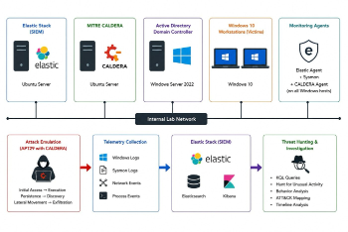

# 🏗️ SOC Lab Architecture

## Overview

The project was implemented in an isolated virtual laboratory designed to support **APT29 adversary emulation, security monitoring, threat detection, and incident response**.

The environment consisted of five virtual machines connected through the same internal laboratory network. The Windows systems formed an Active Directory environment, while the Elastic Security and MITRE CALDERA servers provided monitoring and adversary-emulation capabilities.

> [!IMPORTANT]
> The laboratory was isolated from production systems. All attack-emulation activities were performed in a controlled and authorized environment.

---

## Architecture Diagram

*Figure 1: Architecture and security-monitoring workflow of the APT29 SOC laboratory.*

---

## System Components

| System | Operating System | Domain Status | Primary Role |
|:---|:---|:---|:---|
| **DC01** | Windows Server 2022 | Domain controller | Active Directory Domain Services, DNS, authentication, and security auditing |
| **WS01** | Windows 10 | Domain joined | User workstation and attack-emulation target |
| **WS02** | Windows 10 | Domain joined | User workstation and attack-emulation target |
| **ES01** | Ubuntu Server | Outside domain | Elastic Stack, Fleet, telemetry storage, detection, and investigation |
| **CALDERA01** | Ubuntu Server | Outside domain | MITRE CALDERA server for APT29 adversary emulation |

---

## Active Directory Environment

The Windows systems were configured within the `corp.local` Active Directory domain.

**DC01** provided centralized:

- User and computer authentication
- Domain Name System services
- Group Policy management
- Windows security auditing
- PowerShell logging configuration
- Domain account administration

**WS01** and **WS02** were joined to the domain and used as monitored endpoints during the adversary-emulation operation.

A decoy service account was also configured to support identity monitoring and detection testing.

---

## Network Design

All virtual machines were connected through the same **isolated internal laboratory network**.

This configuration allowed the systems to communicate with one another without exposing the attack environment to production systems or external networks.

The network supported communication between:

- Windows endpoints and the domain controller
- Elastic Agents and the Fleet server
- CALDERA agents and the CALDERA server
- Monitored endpoints and Elastic Security
- Analysts and the Kibana investigation interface

> [!NOTE]
> Specific IP addresses and unnecessary internal network details are excluded from this public repository for security and privacy purposes.

---

## Monitoring and Telemetry Collection

Elastic Agent was installed on the Windows endpoints to collect and forward security telemetry to **ES01**.

The collected telemetry included:

- Windows Security event logs
- PowerShell activity
- Sysmon events
- Process creation events
- Authentication activity
- File and registry activity
- Network connection events

Fleet was used to centrally manage the deployed Elastic Agents and monitor their connection status.

---

## Adversary-Emulation Infrastructure

**CALDERA01** hosted MITRE CALDERA and was used to execute selected APT29 techniques against the authorized Windows targets.

The emulated attack chain included activities associated with:

1. Initial access
2. Execution
3. Persistence
4. Discovery
5. Lateral movement
6. Collection and exfiltration simulation

CALDERA agents were deployed on the selected Windows hosts to execute the approved abilities and return operation results to the CALDERA server.

---

## Detection and Investigation Flow

The security-monitoring workflow followed four main stages:

1. **Attack Emulation** – CALDERA executed selected APT29 techniques.
2. **Telemetry Collection** – Elastic Agent and Sysmon collected endpoint activity.
3. **Detection and Analysis** – Elastic Security processed the events and generated alerts.
4. **Threat Hunting** – Analysts used KQL, ES|QL, timelines, and ATT&CK mapping to investigate the activity.

---

## Data Flow

| Source | Destination | Purpose |
|:---|:---|:---|
| **WS01 and WS02** | **DC01** | Domain authentication, DNS, and Group Policy |
| **Windows hosts** | **ES01** | Security telemetry and endpoint events |
| **CALDERA agents** | **CALDERA01** | Ability execution, instructions, and operation results |
| **Elastic Agent** | **Fleet** | Agent management, policy updates, and health monitoring |
| **Elasticsearch** | **Kibana** | Search, visualization, alert investigation, and threat hunting |

---

## Security Controls

The following controls were configured to improve monitoring and visibility:

- Advanced Windows Audit Policy
- PowerShell module and script-block logging
- Sysmon endpoint monitoring
- Elastic Agent deployment
- Centralized Fleet management
- Custom Elastic detection rules
- KQL and ES|QL threat-hunting queries
- MITRE ATT&CK technique mapping
- Controlled and isolated virtual networking

---

## Architecture Challenges

The main architecture-related challenges included:

- Connecting virtual machines hosted on different physical devices
- Working around restrictions imposed by the campus wireless network
- Maintaining communication between CALDERA agents and the server
- Resolving WinRM authentication and permission problems
- Maintaining Elastic Agent and Fleet connectivity
- Synchronizing time across the monitored systems
- Ensuring telemetry was received before executing the attack operation

These challenges were addressed through isolated networking, connectivity testing, policy configuration, credential verification, and time synchronization.

---

## Related Documentation

- [Project Overview](project-overview.md)
- [APT29 Attack Scenario](attack-scenario.md)
- [Detection and Threat Hunting](detection-and-hunting.md)
- [Incident Response](incident-response.md)
- [Validation Metrics](validation-metrics.md)
- [Challenges and Lessons Learned](challenges-and-lessons-learned.md)

---

## Summary

The architecture integrated Active Directory, Windows endpoints, Elastic Security, Fleet, Sysmon, and MITRE CALDERA into one controlled SOC laboratory. This design enabled the team to emulate APT29 activity, collect endpoint telemetry, generate detections, conduct threat hunting, and evaluate the effectiveness of the monitoring and response workflow.
