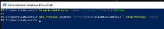

# 🛑 Incident Containment

## Overview

After confirming the simulated APT29 intrusion, containment actions were performed to prevent additional execution, lateral movement, and communication with the CALDERA command-and-control server.

The primary affected endpoint was **WS01**. Containment was performed before removing any adversary artifacts, following the incident-response lifecycle defined in **NIST SP 800-61 Rev. 2**.

> [!IMPORTANT]
> These actions were performed in an isolated and authorized laboratory environment. Commands may interrupt network connectivity and user access and should not be executed on production systems without approval.

---

## Containment Objectives

The containment phase aimed to:

- Disconnect the compromised endpoint from the laboratory network
- Stop the active CALDERA agent
- Prevent the compromised account from being used
- Stop further lateral movement
- Preserve available evidence for investigation
- Confirm containment before beginning eradication

---

## Affected Assets

| Asset | Role | Containment Action |
|:---|:---|:---|
| **WS01** | Primary compromised workstation | Network adapter disabled |
| **WS01** | CALDERA execution target | CALDERA agent process terminated |
| **WS02** | Secondary affected workstation | CALDERA agent process checked and terminated |
| **DC01** | Domain controller | CALDERA agent process checked and terminated |
| **Compromised account** | Domain identity associated with WS01 | Account disabled in Active Directory |

---

## Containment Sequence

Containment actions were performed in the following order:

1. Isolate WS01 from the network.
2. Stop the CALDERA agent process.
3. Stop the CALDERA agent on any other affected hosts.
4. Disable the compromised account in Active Directory.
5. Verify that all containment actions succeeded.
6. Proceed to eradication only after verification.

---

## 1. Isolate the Compromised Endpoint

The network adapter on **WS01** was disabled to prevent communication with other laboratory systems and the CALDERA server.

```powershell
Disable-NetAdapter -Name "Ethernet" -Confirm:$false
```

The adapter status was then verified:

```powershell
Get-NetAdapter | Select-Object Name, Status
```

### Expected Result

```text
Name       Status
----       ------
Ethernet   Disabled
```

This action restricted additional command execution, lateral movement, and simulated data exfiltration from WS01.

### Evidence



*Figure 1: Verification that the WS01 Ethernet adapter was disabled.*

---

## 2. Stop the CALDERA Agent

The CALDERA agent used during the authorized emulation was terminated on the affected hosts.

```powershell
Get-Process splunkd -ErrorAction SilentlyContinue | Stop-Process -Force
```

The process status was verified using:

```powershell
Get-Process splunkd -ErrorAction SilentlyContinue
```

No returned process indicated that the CALDERA agent was no longer running.

### Evidence


*Figure 2: CALDERA agent termination and post-action verification.*

> [!NOTE]
> The agent was intentionally named `splunkd.exe` by the CALDERA Sandcat deployment. It was not a legitimate Splunk service in this laboratory.

---

## 3. Disable the Compromised Account

The compromised account was disabled from the domain controller to prevent further authentication and remote access.

```powershell
Disable-ADAccount -Identity "ws01"
```

The account status was verified using:

```powershell
Get-ADUser -Identity "ws01" -Properties Enabled |
    Select-Object Name, Enabled
```

### Expected Result

```text
Name   Enabled
----   -------
ws01   False
```

### Evidence


*Figure 3: Active Directory verification showing that the compromised account was disabled.*

---

## Containment Verification

| Verification Check | Expected Result | Status |
|:---|:---|:---:|
| WS01 network adapter | Disabled | ✅ Completed |
| CALDERA agent on WS01 | Not running | ✅ Completed |
| CALDERA agent on WS02 | Not running | ✅ Completed |
| CALDERA agent on DC01 | Not running | ✅ Completed |
| Compromised AD account | Disabled | ✅ Completed |
| Further CALDERA execution | Prevented | ✅ Completed |

---

## Containment Result

The containment actions successfully:

- Isolated the primary compromised workstation
- Terminated active CALDERA agent execution
- Disabled the affected domain identity
- Restricted additional lateral movement
- Prevented continued communication with CALDERA
- Prepared the affected systems for eradication

After confirming these results, the team proceeded to remove persistence mechanisms, staged files, credential-access tools, and CALDERA agent binaries during the eradication phase.

---

## Limitations

The containment process was performed manually because the laboratory did not include a Security Orchestration, Automation, and Response platform.

In a production environment, equivalent actions should:

- Require analyst authorization
- Follow organizational approval procedures
- Preserve forensic evidence before making changes
- Be coordinated with system owners
- Be recorded in the incident-management system
- Consider operational and business impact

---

## Lessons Learned

- A compromised endpoint should be isolated before artifacts are removed.
- Disabling an account prevents further identity-based access but does not terminate existing malicious processes.
- Stopping a process alone does not remove its executable or persistence mechanisms.
- Each containment action must be verified independently.
- Containment and eradication should be documented as separate incident-response phases.
- Automated response could reduce containment time, but manual approval remains important for high-impact actions.

---

## Related Documentation

- [Incident-Response Overview](../../docs/incident-response.md)
- [Identification Evidence](../identification/)
- [Eradication Evidence](../eradication/)
- [Recovery Evidence](../recovery/)
- [Lessons Learned](../lessons-learned/)
